<a name="API"></a>

<br />
<div align="center">
  <a href="#">
    
  </a>
</div>

## Sobre o projeto

<div>
<p>Esta api foi escrita com o intuito de conectar diversar partes do sistema da mini estufa <br><br>
Deve ser usado em conjunto com o <a href="https://github.com/FIAP-grupo-challenge/Python_algoritimo_assincrono_GS">algoritimo_assincrono</a></p>

<p>Areas que a API conecta: <br>
* Sensores/Arduino da estufa <br>
* Banco de dados <br>
* Site da empresa <br>
* Dashboard do cliente</p>
</div>
<div align="center">

</div>

## Dependencias (bibliotecas)
1. <a href="https://flask.palletsprojects.com/en/2.3.x/">Flask</a> : O Flask é um framework web em Python para desenvolvimento rápido e fácil de aplicações web.
2. <a href="https://pypi.org/project/python-dotenv/">Python-dotenv</a> : python-dotenv é uma biblioteca em Python que permite carregar variáveis de ambiente de um arquivo .env para facilitar a configuração de uma aplicação.
3. <a href="https://pypi.org/project/psycopg2/">Psycopg2-binary</a> : psycopg2 é uma biblioteca em Python que fornece uma interface para se conectar e interagir com bancos de dados PostgreSQL. Estamos utilzando a versão "binary" Para evitar problemas de compatibilidade com a biblioteca <a href="https://flask.palletsprojects.com/en/2.3.x/">Flask</a>
4. <a href="https://flask-cors.readthedocs.io/en/latest/">Flask-cors</a> : Flask-CORS é uma extensão do Flask que permite lidar facilmente com a política de mesmo origem (Same-Origin Policy) e habilitar CORS (Cross-Origin Resource Sharing) em aplicativos web <a href="https://flask.palletsprojects.com/en/2.3.x/">Flask</a>.

## Instalação
1. Clonar o respositorio
    ```sh
    git clone https://github.com/FIAP-grupo-challenge/Python_GS.git
    ```
2. Instalar dependencias
    ```sh
    pip install -r requirements.txt
    ```
3. Rodar o flask (servidor de desenvolvimento)
    ```sh
    flask run --port 80 
    ```
    <div>
    <p>
    Não eh necessario que o programa seja executado na porta 80, contudo a demonstração deste
    documento sera feita no servidor de desenvolvimento do flask (improprio para produção) e porta 80
    </p></div>

## Endpoints
1. Criar conta
    ```text
    /api/create/acount
    ```
   <div>
   <p>
   Uso: criar uma conta no banco de dados <br>
   <br> Exemplo: </p>
   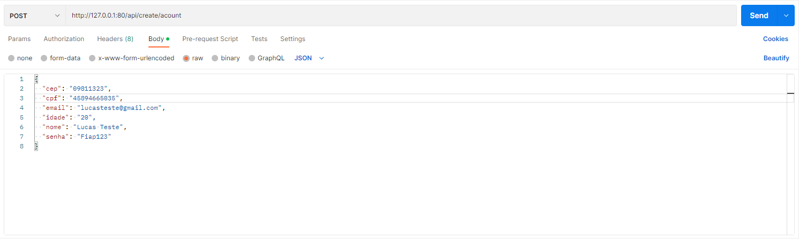<br>
   <p>Este endpoint possui validações e deve ser vir acompanhado de um body que possui nome, idade, email, cpf, cep e senha</p><br>
   <p>Validações:<br>
   * email :<br> 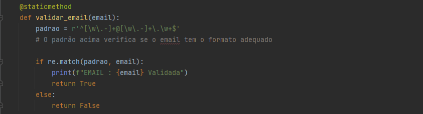<br>
   * idade :<br> 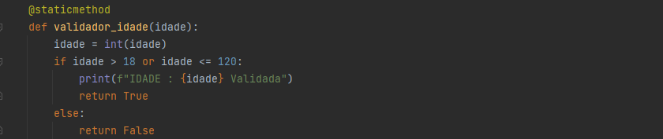<br>
   * cpf :<br> 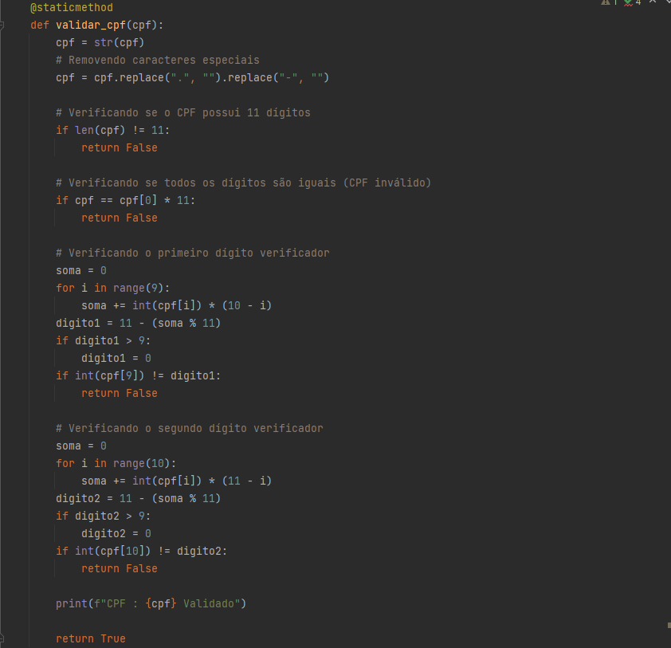<br>
   * cep :<br> 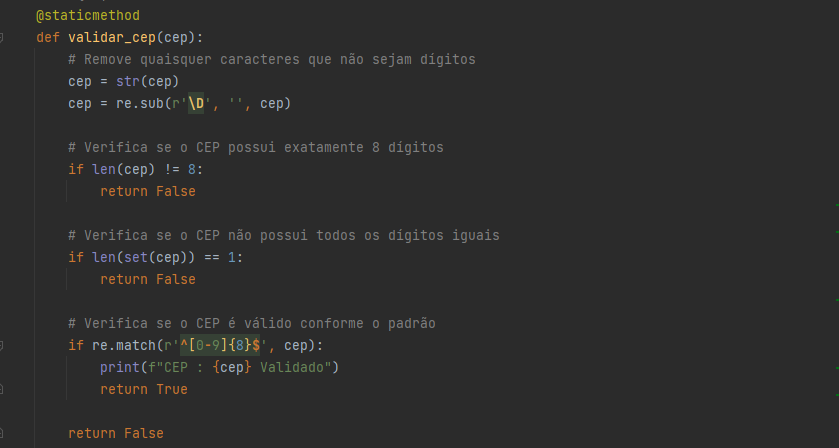</p><br><br><br></div>

2. Mudar informações da conta
    ```text
    /api/update/cliente
    ```
   <div>
   <p>
   Uso: Modifica um elemento especifico da informação do cliente  <br>
   <br> Exemplo: </p>
   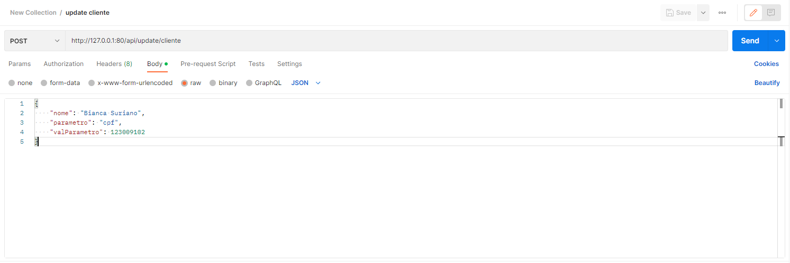
   este endpoint deve vir acompanhado de um body que contem nome, parametro, e valor do parametro
   <p>Lista de parametros editaveis:<br>
   * nome<br>
   * email<br>
   * idade<br>
   * cpf<br>
   * cep<br>
   * senha</p><br><br><br></div>
   
3. Buscar cliente por ID
    ```text
    /api/get/client?id=(id desejado)
    ```
   <div>
   <p>
   Uso: Buscar informações de um cliente que voce tem o ID <br>
   <br> Exemplo: </p>
   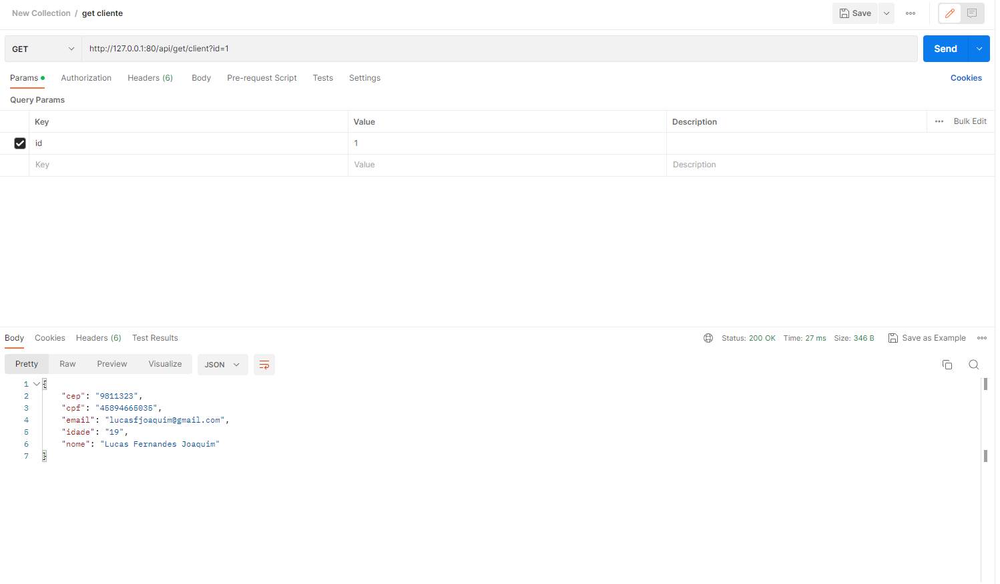<br>
   <p>
   Este endpoint deve receber um parametro id para que a busca possa ser feita</p><br><br><br></div>

4. Lista de clientes
    ```text
    /api/get/client/list
    ```
   <div>
   <p>
   Uso: Fornece uma lista de clientes que mostra os seus nomes e IDs <br>
   <br> Exemplo: </p>
   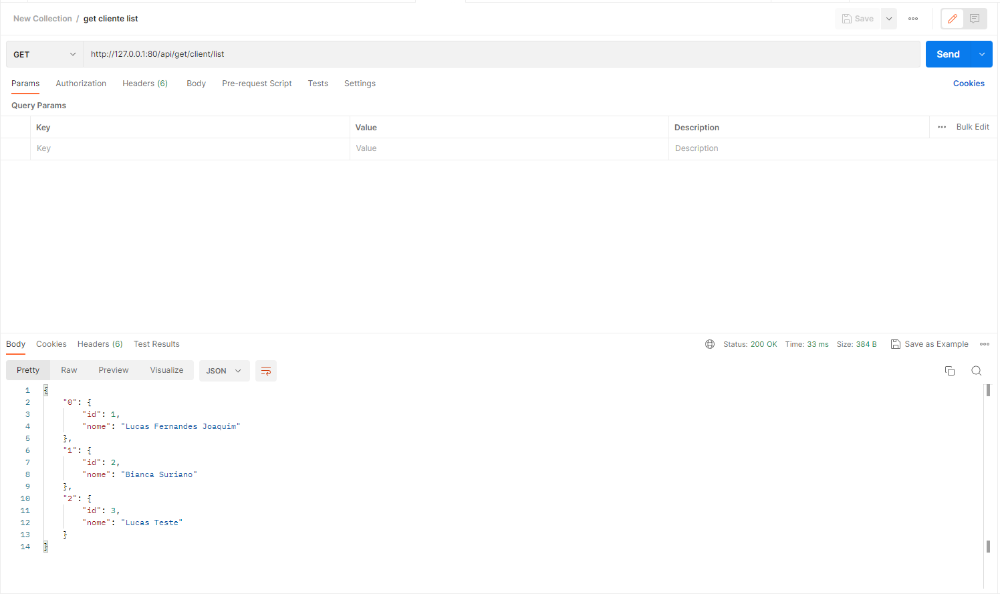<br><br><br></div>

5. Lista de plantas por id de cliente
    ```text
    /api/get/plant/list?id=(id desejado)
    ```
   <div>
   <p>
   Uso: Fornece uma lista de todas as plantas daquele cliente <br>
   <br> Exemplo: </p>
   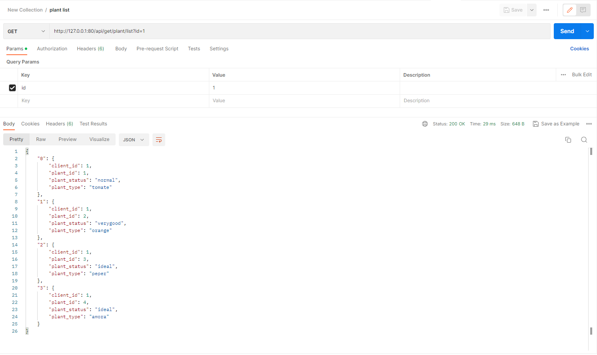<p>
   Este endpoint deve receber um parametro id para que a busca possa ser feita</p><br><br><br></div>

6. Obter informações de uma planta em específico
    ```text
    /api/get/plant/info?plant_id=(id da planta desejado)&option=(opção)
    ```
   <div>
   <p>
   Uso: Fornece informações da planta <br>
   <br> Exemplo: </p>
   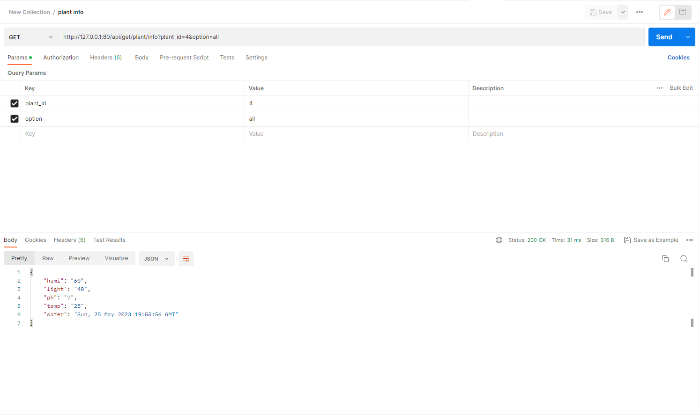<p>
   Este endpoint deve receber um parametro id para que a busca possa ser feita<br>
   juntamente do parametro options</p><br>
   <p>Parametro option:<br>
   * all : retorna todas as informações da planta<br>
   * temp : retorna a temperatura do ambiente da planta<br>
   * humi : retorna a humidade do ambiente da planta<br>
   * light : retorna a luminosidade do ambiente da planta<br>
   * ph : retorna o ph do solo no ambiente da planta<br>
   * water : retorna a ultima vez que a planta foi regada (timestamp)</p><br><br><br></div>

7. Obter login
    ```text
    /api/get/plant/info?plant_id=(id da planta desejado)&option=(opção)
    ```
   <div>
   <p>
   Uso: Rota simples que verifica se o usuario e a senha batem <br>
   <br> Exemplo: </p>
   <p>
   Este endpoint deve receber um body contendo o nome e a senha que o usuario digitou</p><br><br><br>

8. Criar informação da planta
    ```text
    /api/create/plant/info
    ```
   <div>
   <p>
   Uso: Rota simples para criar registro no banco com informações da planta <br>
   <br> Exemplo: </p>
   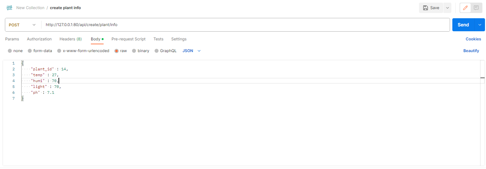<p>
   Este endpoint deve receber um body contendo:<br>
   plant_id <br>
   temp (temperatura)<br>
   humi (humidade)<br>
   light (luz)<br>
   ph</p><br><br><br>

9. Criar planta
    ```text
    /api/create/plant
    ```
   <div>
   <p>
   Uso: Rota para criar uma planta no banco de dados, atualmente aceitando os<br>
   12 tipos de plantas presentes no sistema<br>
   <br> Exemplo: </p>
   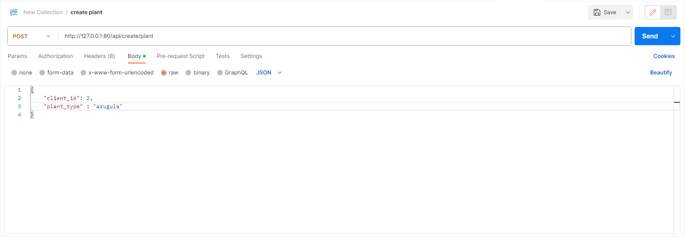<p>
   Este endpoint deve receber um body contendo: <br>
   client_id (id do cliente)<br>
   plant_type(tipo da planta)</p><br><br><br>
## Banco de dados

<div>
<p>
Para uma documentação mais completa do Banco visite o respositorio <a href="https://github.com/FIAP-grupo-challenge/Banco_de_dados_GS">Banco de Dados</a></A><br><br>
O banco de dados escolhido para esta aplicação foi <a href="https://www.postgresql.org">PostgreSQL</a><br><br>
Motivos desta escolha: <br><br>
* Maturidade e estabilidade: O PostgreSQL tem uma história de desenvolvimento longa e bem estabelecida, remontando a mais de 30 anos. Ele é conhecido por sua confiabilidade, robustez e estabilidade, sendo amplamente utilizado em ambientes de produção exigentes.<br>
* Suporte a SQL completo: O PostgreSQL adere estritamente aos padrões ANSI SQL e oferece suporte a um amplo conjunto de recursos SQL, incluindo subconsultas, junções complexas, desencadeadores (triggers), procedimentos armazenados e muito mais. Isso torna o PostgreSQL altamente compatível com outras bases de dados e facilita a migração de aplicativos de outros sistemas de gerenciamento de banco de dados.<br>
* Extensibilidade: O PostgreSQL é altamente extensível, permitindo que os usuários adicionem novos tipos de dados, funções, operadores e até mesmo recursos personalizados por meio de extensões. Além disso, ele suporta várias linguagens de programação (como PL/pgSQL, PL/Python, PL/Java) para escrever procedimentos armazenados e funções personalizadas.<br>
* Recursos avançados: O PostgreSQL possui uma ampla gama de recursos avançados, incluindo suporte a transações ACID (Atomicidade, Consistência, Isolamento e Durabilidade), replicação síncrona e assíncrona, particionamento de tabelas, índices avançados (como índices GIN e GiST para pesquisa de texto completo e dados geométricos), entre outros. Esses recursos fornecem flexibilidade e desempenho aprimorado para uma variedade de casos de uso.<br>
* Suporte a dados geoespaciais: O PostgreSQL possui suporte nativo a dados geoespaciais, permitindo a realização de consultas e operações complexas em dados com componentes espaciais. Isso é particularmente útil para aplicativos de mapeamento, sistemas de informação geográfica (GIS) e análises baseadas em localização.<br>
* Comunidade ativa: O PostgreSQL possui uma comunidade de usuários ativa e engajada, que contribui com melhorias, correções de bugs e desenvolvimento contínuo do sistema. Essa comunidade vibrante resulta em um software de alta qualidade, suporte técnico abrangente e ampla disponibilidade de recursos e tutoriais online.<br>
* Licença de código aberto: O PostgreSQL é distribuído sob a licença PostgreSQL, que é uma licença de código aberto. Isso significa que você pode usá-lo, modificá-lo e distribuí-lo gratuitamente, além de ter acesso ao código-fonte completo. A licença de código aberto promove a transparência, flexibilidade e independência em relação a um fornecedor específico.
</p><br>
<p>Conexão da API com o Banco: <br><br>
A conexão é feita por meio da biblioteca do Python <a href="https://pypi.org/project/psycopg2/">psycopg2</a> utilizando a URL de conexão como parametro</p><br>
<p>Credenciais de conexão:<br><br>
A credencial de conexão via URL se encontra no arquivo .env</p><br>
<p>Hospedagem do banco de dados:<br><br>
O banco de dados atualmente se econtra hospedado com o serviço gratuito <a href="https://www.elephantsql.com">ElephantSQL</a></p></div>

## Desenvolvedores
1. Nome: Lucas Fernandes Joaquim, RM: 551313
2. Nome: Gustavo Ferreira Lopes, RM: 98887
3. Nome: heitor freire dos anjos, RM: 552165
4. Nome: Rodrigo Fernandes dos Santos, RM: 98896
5. Nome: Enzo Silva Cataldi, RM: 99826